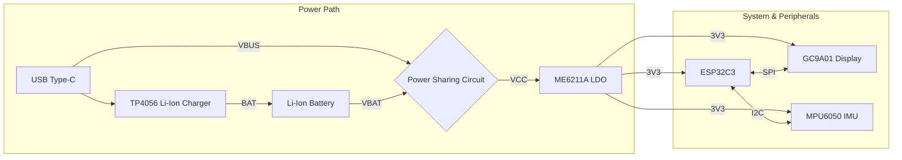
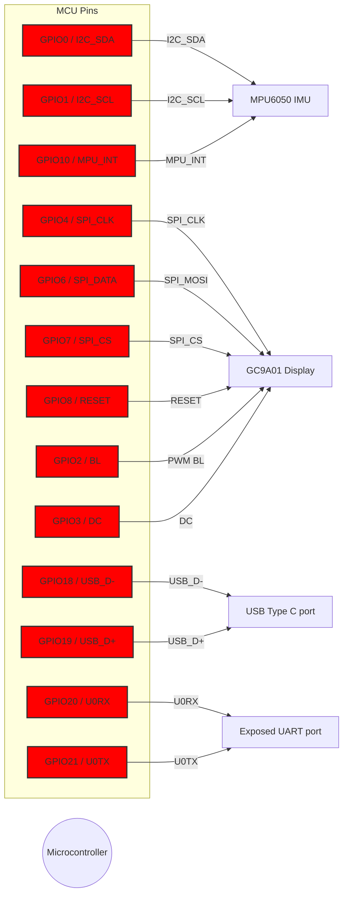

# ESP32C3 Smart Board

**Product Name:** ESP32C3 Smart Board  
**Board Revision:** 1.3  
**Updated:** 26.12.2025  
**Author:** Marko Petrov (petrovgp)  

---

## 1. General Description

The ESP32C3 Smart board is a compact, battery-powered ESP32-based development board designed in **KiCad 9**, integrating power management, motion sensing, and display support in a small form factor. Ideal for low-power IoT or wearable applications.

---

## 2. Features

- ESP32 C3 MCU
    - ESP32C3FH4, RISC-V single-core 32-bit processor, up to 160 MHz
    - 4MB internal flash
    - 400KB SRAM
    - Wi-Fi 2.4 GHz IEEE 802.11 b/g/n
    - Bluetooth 5 (LE)
- ME6211A LDO regulator
    - 3.3V output voltage
    - 500mA max output current
    - 100mV @ 100mA dropout voltage
- Li-ion charging and protection ICs
    - TP4056 charging IC configured at 250mA
    - DW01A + FS8205A protection ICs
    - Power sharing circuit for use while charging
- MPU6050 accelerometer
    - Supports interrupt mode with INT pin
- GC9A01 display
    - 240x240 TFT color display
    - Supports up to 40MHz (40Mbps) on hardware SPI
- USB Type C connector
    - Power and programming interface for ESP32C3

---

## 3. Functional Block Diagram

---

## 4. Absolute Maximum Ratings

### Voltage ratings

| Parameter                      | Min | Typ | Max | Unit |
|--------------------------------|-----|-----|-----|------|
| USB Type C voltage (VBUS)      | 4.0 | 5.0 | 6.5 |   V  |
| Battery voltage (VBAT)         | -0.3| 3.6 | 4.2 |   V  |
| High-level input voltage (VIH) | 2.5 |  -  | 3.6 |   V  |
| Low-level input voltage (VIL)  | -0.3|  -  | 0.8 |   V  |
| High-level output voltage (VOH)| 2.6 |  -  |  -  |   V  |
| Low-level output voltage (VOL) |  -  |  -  | 0.33|   V  |
| Ambient temperature            | -40 | 25  | 125 |  °C  |

### Current ratings

| Parameter                        | Min | Typ | Max | Unit |
|----------------------------------|-----|-----|-----|------|
| Input current (IBUS), w/ battery | 250 | 350 | 630 |  mA  |
| Input current (IBUS), no battery | 0.02| 100 | 380 |  mA  |
| Battery charing current          |  -  | 250 |  -  |  mA  |

> Recommended operating conditions are the typical values

---

## 5. Pin configurations

---